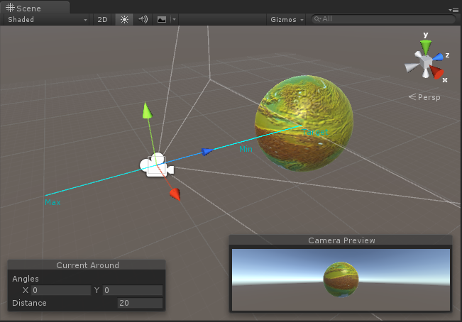
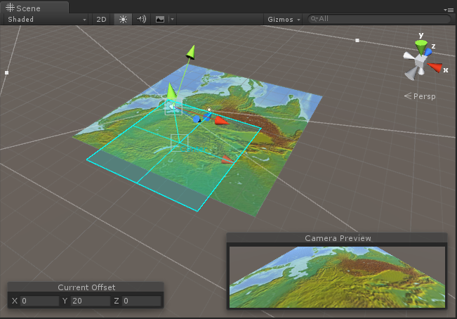
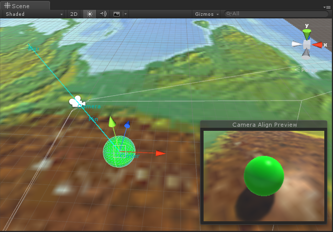

# MGS-Camera
- [中文手册](./README_ZH.md)

## Summary
- Unity plugin for control camera in scene.

## Demand
- Translate camera by mouse pointer drag.
- Camera rotate around target gameobject.
- Camera smooth align to mark gameobject.

## Environment
- Unity 5.0 or above.
- .Net Framework 3.0 or above.

## Scheme
- Calculate camera position base on mark center gameobject.
- Calculate camera position and rotation base on mark target gameobject.
- Smooth lerp position and rotation of camera.

## Achieve
- MouseTranslate : Translate gameobject by mouse pointer drag.
- AroundCamera : Camera rotate around target gameobject.
- AroundAlignCamera : Camera rotate around target gameobject and align to mark gameobject.
- MouseFocus : Align camera to gameobject on mouse pointer double click it.
- AlignMark : Mark gameobject as align target and config align parameters.

## Demo
- Demos in the path "MGS-Camera/Scenes" provide reference to you.

## Preview
- Around

- Translate

- AlignPreview



## Contact
- If you have any questions, fell free to contact me at mogoson@qq.com.