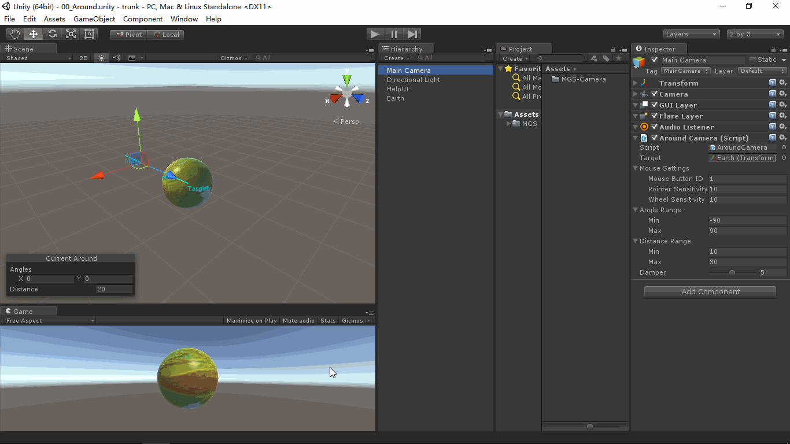

# MGS-Camera
- [English Manual](./README.md)

## 概述
- Unity控制摄像机移动，旋转插件包。

## 需求
- 平移摄像机。
- 环绕摄像机。
- 平滑对齐摄像机。

## 环境
- Unity 5.0 或更高版本。
- .Net Framework 3.0 或更高版本。

## 方案
- 基于标记的中心Center计算摄像机位移。
- 基于指定目标Target计算摄像机位移和旋转。
- 平滑插值位移和旋转。

## 实现
- MouseTranslate：鼠标拖拽平移目标。
- AroundCamera：目标环绕摄像机。
- AroundAlignCamera：目标环绕，平滑对齐摄像机。
- MouseFocus：配合AroundAlignCamera组件实现鼠标双击物体后平滑对齐。
- AlignMark：标记目标物体的对齐信息。

## 案例
- “MGS-Camera/Scenes”目录下存有上述功能的演示案例，供读者参考。

## 图示
- Around

- AlignPreview



- Focus

## 联系
- 如果你有任何问题或者建议，欢迎通过mogoson@qq.com联系我。